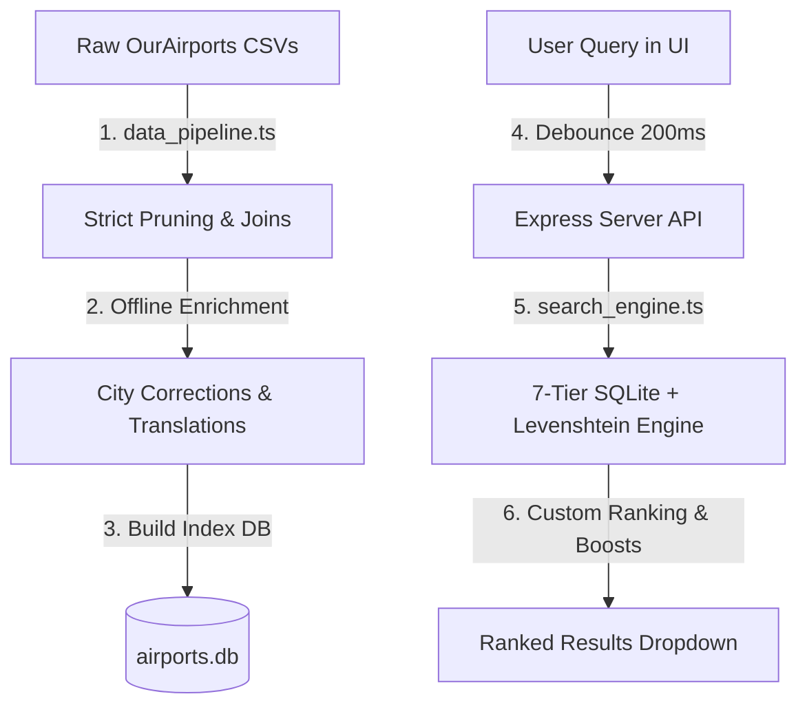

# Fly Fairly: Airport Autocomplete Search Engine Approach Memo

This memo outlines the engineering design, architectural trade-offs, and implementation details for the **Fly Fairly** end-to-end airport autocomplete search flow.

---

## 1. Core Problem & Product Constraints
Search is the entry point of the booking funnel. A fragile, slow, or incorrect search directly correlates with lost revenue. The airport autocomplete must solve several real-world ambiguities:
*   **Typos & Spelling Mistakes**: Resolving "Londn" to London airports.
*   **Regional Searches**: Mapping "Hawaii" to its key commercial hubs.
*   **Multi-Airport Cities**: Mapping "LON" or "London" to LHR, LGW, STN, LCY, LTN.
*   **Accent/Diacritic Ambiguities**: Seamlessly searching "São Paulo" via `sao paulo` or `são paulo`.
*   **Foreign Scripts**: Resolving "東京" or "서울" to their correct international airports.
*   **Municipality Discrepancies**: Connecting Brussels Airport to its commercial name, rather than the raw database municipality "Zaventem".
*   **Cross-Continental Ambiguity**: Distinguishing London, UK (LHR/LGW) from London, Canada (YXU) or London, Kentucky (LOZ), and prioritizing Florida, USA over La Florida, Chile.

---

## 2. Architecture: Offline Enrichment & Indexed SQLite Engine
Rather than relying on high-latency, expensive runtime APIs or heavy search cluster setups (like Elasticsearch), we implemented a **highly performant, 100% offline, relational approach** using Node.js + TypeScript + SQLite.

### A. Data Sourcing & Offline Pipeline (`src/data_pipeline.ts`)
*   **Strict Commercial Pruning**: Cleaned the raw OurAirports dataset of 85,000+ entries. We filtered out closed facilities, heliports, seaplanes, and military airbases, yielding **8,707 commercial passenger airports**.
*   **Relational Joins**: Joined region and country codes with full, readable English names.
*   **Friendly City Corrections**: Corrected municipality naming errors (e.g. mapping IATA `BRU` to `Brussels` instead of the raw `Zaventem` municipality).
*   **Offline Translation & Alias Enrichment**: Instead of calling an LLM at runtime, we injected CJK translations (`東京`, `서울`), Arabic names (`دبي`), city-level group mappings (`LON`, `TYO`, `SAO`, `NYC`), and regional aliases (`Bali` -> Denpasar `DPS`) **offline**. This eliminates runtime LLM delays, matches search intent deterministically, and saves $0 in API costs.
*   **Importance Scoring**: Calculated a static `importance_score` based on airport type (`large_airport` = 100, `medium_airport` = 30-75, `small_airport` = 5-25) and scheduled commercial passenger status. We added a **+15 "International" boost** to automatically favor major hubs in sorting.

### B. Tiered Search & Ranking Engine (`src/search_engine.ts`)
When a query hits the Express server, the search engine processes it in sub-milliseconds:
1.  **Normalization**: Strips diacritics using NFD Unicode normalization (e.g., `São Paulo` -> `sao paulo`) and forces lowercase.
2.  **Fast SQLite Candidate Retrieval**: Utilizes indexed columns (`iata`, `city_code`, `city`, `region`) for prefix and substring matching to pull a small set of matching rows in `<1ms`.
3.  **7-Tier Ranking Algorithm**:
    *   *Tier 1*: Exact IATA Code Match (e.g. `TUL` -> score 10,000)
    *   *Tier 2*: Exact City Group Code Match (e.g. `LON` -> score 8,000)
    *   *Tier 3*: Exact City Name Match (e.g. `Brussels` -> score 5,000)
    *   *Tier 4*: Exact Region Name Match (e.g. `Hawaii` -> score 2,000)
    *   *Tier 5*: Exact Country Name Match (e.g. `Bahrain` -> score 1,500)
    *   *Tier 6*: Prefix / Substring / Offline Translation Alias Match (e.g. `東京` -> score 700-1200)
    *   *Tier 7*: Typo Tolerance (Levenshtein distance <= 2 on IATA or City -> score 500-1750)
4.  **Size-Based Multiplier Boosting**:
    *   `Score = MatchScore * (0.5 + ImportanceScore / 100)`
    *   This ensures London, UK (LHR) naturally outranks London, Canada (YXU) or London, Kentucky (LOZ), and Florida, USA state airports dwarf La Florida in Chile.

---

## 3. Engineering Judgment: Build vs. Buy vs. Fake
*   **Build**: 
    *   *7-Tier Custom Ranking*: Standard search libraries (like MiniSearch) lack the ability to prioritize business logic (e.g., boosting exact IATA or City Codes over substrings) or apply passenger volume multipliers. Building the scoring logic ourselves was critical.
    *   *Offline Ingestion Pipeline*: Transformed a dirty raw dataset into a structured, highly indexed relational database.
*   **Buy / Use Library**:
    *   *SQLite (`better-sqlite3`)*: Used SQLite for local structured persistence. Writing an indexer from scratch would be redundant; SQLite handles relational joins, indices, and transactions at lightning speeds.
    *   *Tailwind CSS & Vite*: Standardized the build chain for clean modern styling and lightning-fast developer iteration.
*   **Cut / Fake**:
    *   *Runtime LLM Queries*: Cut runtime AI calls entirely. Autocomplete demands `<50ms` typing response times. Runtime API calls introduce `500ms+` latency, network risks, rate limits, and ongoing API expenses. By moving translation aliases to the *offline ingestion pipeline*, we achieved the exact same multilingual resolving benefits for **0ms runtime latency and $0 cost**.

---

## 4. LLM Fluency & Evaluation Metrics
*   **Data Enrichment & Corrections**: Used LLM tooling during development to audit the municipality mapping arrays and quickly compile foreign script translations for the top 50 global cities.
*   **Automated Verification**: Built a deterministic test suite `eval.spec.ts` matching all 12 mandatory product edge-cases. This ensures any regression in search, ranking, or pruning is caught instantly before merging to main.
*   **Production Metrics**: In a production deployment, we would track:
    1.  *Zero-Result Rate*: Queries that returned nothing.
    2.  *Average Latency*: Maintaining <20ms API response time.
    3.  *Click Position*: The average rank position of the clicked airport (should be 1.0 - 1.5 if ranking is accurate).
